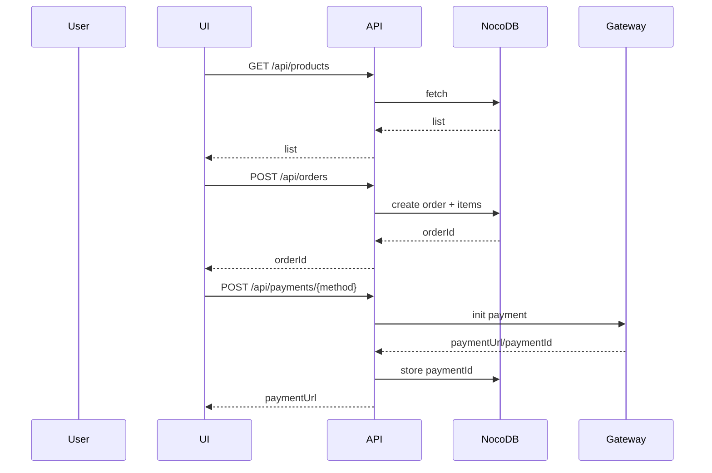
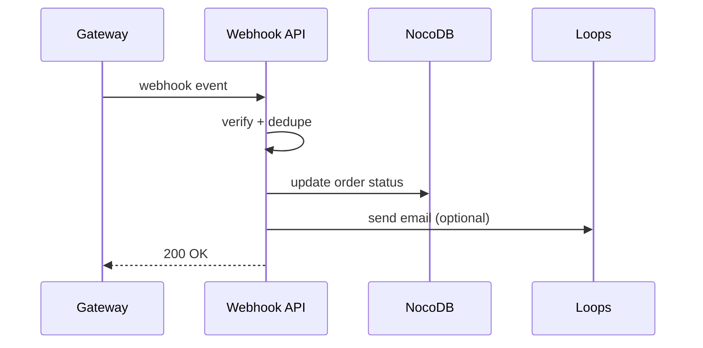
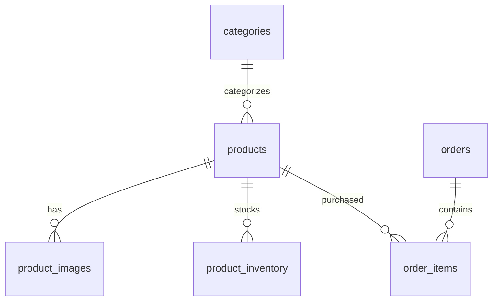

# Kids’ Clothing E‑Store (Bangladesh) — Comprehensive Development Plan

Source PRD: `Kids_Store_PRD_Junior_Dev.md`

## 0) Workspace Skills (Create First)

These are project-specific skills to add under `.trae/skills/<skill-name>/SKILL.md` so future work is faster, safer, and more consistent.

| Skill Name | Description (what it does + when to invoke) |
|---|---|
| `prd-traceability` | Maintains requirement IDs and traceability. Invoke when adding/changing features or tests to ensure PRD coverage and update the traceability matrix. |
| `nocodb-integration` | Implements/validates NocoDB client and schema mapping. Invoke when building or debugging any data access, schema, or API route that touches NocoDB. |
| `payments-bd-gateways` | Guides bKash/Nagad integration patterns, webhook idempotency, and sandbox testing. Invoke when implementing payment initiation or webhook handlers or investigating payment bugs. |
| `tdd-coverage-enforcer` | Ensures TDD loops and ≥80% coverage gates. Invoke when adding new modules/components or when coverage drops/fails in CI. |
| `accessibility-wcag-aa` | Provides WCAG 2.1 AA checks for shadcn/ui and custom UI. Invoke when creating UI components, forms, or reviewing UX changes. |
| `perf-lighthouse` | Defines Lighthouse and runtime performance workflow. Invoke when product pages feel slow, image/CLS issues appear, or before releases. |
| `release-ops` | Standardizes staging/prod deploy, env vars, rollback, monitoring. Invoke when setting up CI/CD, staging, production cutovers, or incidents. |

Deliverable: add these skills as markdown skill definitions (frontmatter + usage instructions + examples).

## 0.1) Project Rules (Create Second — maximize success)

Create `docs/ENGINEERING_RULES.md` (and link it from README) with non-negotiable rules:

**Architecture rules**
- Keep NocoDB tokens server-only; never expose to client.
- All API routes validate input with Zod; return structured errors.
- Payments and webhooks must be idempotent; no double emails/WhatsApps.

**TDD rules** (from PRD)
- Red → Green → Refactor loop.
- Coverage minimum: 80% lines/functions/branches/statements.
- No feature merged without tests for the new behavior.

**UI/component rules** (from PRD)
- Components must be small, typed, reusable, and testable.
- Prefer shadcn/ui components for accessibility.

**Security rules**
- No logging of secrets; mask PII.
- Verify webhook signatures.
- Add rate limiting to public endpoints (orders, webhooks).

**Delivery rules**
- Every PR includes: tests, screenshots (UI), updated docs if behavior changes.

Deliverable: `docs/ENGINEERING_RULES.md` + a short `docs/SECURITY.md` + `docs/API.md`.

---

## 1) Project Analysis

### 1.1 Functional Requirements Breakdown (Traceable to PRD)

| Req ID | Functional Requirement | PRD Reference |
|---|---|---|
| FR-001 | Browse products (home + listing) | PRD “Folder Structure” (Home, `/products`), “Phase 1 deliverable” |
| FR-002 | Product detail view (images, description, price) | PRD “ProductDetail.tsx” spec |
| FR-003 | Variant selection (size + color) and quantity | PRD “ProductDetail.tsx” |
| FR-004 | Add to cart from grid/detail | PRD “ProductCard.tsx”, “CartStore” |
| FR-005 | Cart management (update qty, remove, total) | PRD “CartItem.tsx”, “CartStore (Zustand)” |
| FR-006 | Checkout delivery form + BD phone validation | PRD “DeliveryForm.tsx” + phone regex |
| FR-007 | Payment method selection (bKash/Nagad) | PRD “PaymentSelector.tsx” |
| FR-008 | Create order + order items persisted | PRD orders/order_items tables; API example |
| FR-009 | Payment initiation (bKash + Nagad) | PRD `/api/payments` + libs |
| FR-010 | Webhook handling for payment updates | PRD `/api/webhooks/bkash.ts`, `/api/webhooks/nagad.ts` |
| FR-011 | Order tracking page by ID | PRD `/order/[id]/page.tsx` |
| FR-012 | Email notifications via Loops | PRD “Loops API” + Phase 4 |
| FR-013 | WhatsApp notifications | PRD “WhatsApp Business API” + Phase 4 |
| FR-014 | Catalog data in NocoDB (products, categories, images, inventory) | PRD “NocoDB Tables” |
| FR-015 | Inventory tracking per variant + low stock threshold | PRD “product_inventory” |
| FR-016 | Mobile responsiveness + Lighthouse ≥90 | PRD “Phase 1 Day 4”, “Success Metrics” |
| FR-017 | Test coverage ≥80% | PRD `vitest.config.ts` thresholds |
| FR-018 | Admin dashboard (bonus) | PRD Phase 5 |
| FR-019 | Robust error handling | PRD “Common pitfalls” + examples |

### 1.2 Technical Constraints  Dependencies

- **App architecture**: Next.js App Router with Route Handlers (`/app/api/*`) (PRD).
- **TDD and coverage gates**: Vitest + Testing Library; ≥80% across metrics (PRD).
- **Market**: Bangladesh currency/phones + local payments (PRD).

External dependencies:
- NocoDB REST API (`xc-auth` header).
- bKash + Nagad sandbox + production credentials and webhook verification.
- Loops transactional templates.
- WhatsApp Business API (template approval dependency).
- Cloudinary (optional) for image CDN.

### 1.3 Risk Assessment  Mitigation

| Risk | Impact | Likelihood | Mitigation |
|---|---|---:|---|
| Payment integration complexity | High | Medium | Isolate gateway module; implement idempotency; test sandbox early |
| Webhook duplicates/out-of-order | High | High | Event dedupe + safe state transitions + event log |
| NocoDB schema mismatch | Medium | Medium | Freeze schema early; strict mapping and Zod validation |
| WhatsApp approval delays | Medium | Medium | MVP relies on email first; WhatsApp feature-flagged |
| Security exposures (tokens/PII) | High | Medium | Server-only secrets; scrub logs; rate limits; signature verification |
| Performance regressions (images/CLS) | Medium | Medium | Next/Image + CDN; measure Lighthouse each phase |

---

## 2) Development Phases

### Phase 1: Core infrastructure setup (database schema, API endpoints, authentication)

Deliverables:
- NocoDB tables/relationships created per PRD.
- NocoDB server client wrapper + typed schemas.
- API routes: products, orders, order tracking.
- **Authentication**: protect admin surfaces from day one.
  - Preferred: NextAuth credentials provider (admin user in env) or middleware Basic Auth for `/admin/*`.

### Phase 2: Feature implementation (prioritized by business value)

Order:
1) Product listing + categories
2) Product detail (variants)
3) Cart store + cart UI
4) Checkout delivery form
5) Order creation + confirmation + tracking
6) Payment selection UI
7) bKash integration + webhooks
8) Nagad integration + webhooks
9) Loops email notifications
10) WhatsApp notifications
11) Admin dashboard (bonus)

### Phase 3: Integration testing and bug fixing
- Full flow tests (browse → cart → checkout → pay → confirm).
- Negative testing (validation, payment fails, out of stock, duplicate webhooks).

### Phase 4: Performance optimization and security hardening
- Lighthouse/real-device performance improvements.
- Security audits for webhooks, rate limiting, secrets handling.

---

## 3) Implementation Details

### 3.1 Technology stack selection (justified)

Matches PRD to reduce risk for a junior dev:
- Next.js (App Router) + TypeScript
- Tailwind CSS + shadcn/ui
- Zustand (cart)
- React Hook Form + Zod (forms + validation)
- Vitest + Testing Library (TDD + coverage)
- NocoDB REST API (DB)
- Loops (email)
- bKash + Nagad (payments)
- WhatsApp Business API (notifications)
- Cloudinary (optional) for images

### 3.2 Component architecture diagram

```mermaid
graph TD
  subgraph UI[Next.js UI]
    Listing[Products Listing]
    Detail[Product Detail]
    Cart[Cart]
    Checkout[Checkout]
    Track[Order Tracking]
    Admin[Admin (bonus)]

    ProductCard[ProductCard]
    ProductGrid[ProductGrid]
    DeliveryForm[DeliveryForm]
    PaymentSelector[PaymentSelector]
    OrderSummary[OrderSummary]
  end

  subgraph State[Client State]
    CartStore[Zustand Cart Store]
  end

  subgraph API[Next.js API]
    ProductsAPI[/api/products]
    OrdersAPI[/api/orders]
    PaymentsAPI[/api/payments/*]
    WebhooksAPI[/api/webhooks/*]
  end

  subgraph External[External Services]
    NocoDB[NocoDB]
    Loops[Loops]
    Bkash[bKash]
    Nagad[Nagad]
    WhatsApp[WhatsApp]
  end

  Listing --> ProductsAPI --> NocoDB
  Detail --> ProductsAPI
  Detail --> CartStore
  Cart --> CartStore
  Checkout --> CartStore
  Checkout --> OrdersAPI --> NocoDB
  Checkout --> PaymentsAPI --> Bkash
  Checkout --> PaymentsAPI --> Nagad
  WebhooksAPI --> NocoDB
  WebhooksAPI --> Loops
  WebhooksAPI --> WhatsApp
```

### 3.3 API specs  data flow diagrams

Endpoints (minimum viable):
- `GET /api/products`
- `GET /api/products/:id`
- `POST /api/orders`
- `GET /api/orders/:id`
- `POST /api/payments/bkash`
- `POST /api/payments/nagad`
- `POST /api/webhooks/bkash`
- `POST /api/webhooks/nagad`

Customer flow:


Webhook flow:


### 3.4 Database schema design



(Implement fields exactly as PRD “NocoDB Tables” defines.)

---

## 4) Testing Strategy

- Coverage gates: **≥80%** across lines/functions/branches/statements.

Integration scenarios:
- Create order with valid/invalid payload
- Payment initiation success/failure
- Duplicate webhook dedupe
- Out-of-stock variant handling

UAT cases:
- Mobile browsing, cart operations, checkout validation, bKash/Nagad sandbox payments, email delivery, tracking page.

Performance benchmarks:
- Lighthouse ≥90; LCP ≤2.5s; CLS ≤0.1.
- API p95: products ≤300ms; orders ≤500ms; webhooks respond ≤200ms (enqueue side effects).

---

## 5) Timeline Estimation

Assumption: 1 junior dev + 0.2–0.3 senior review. Includes 20% buffer.

| Week | Milestone | Deliverables |
|---:|---|---|
| 1 | Infra + auth | DB schema, API baseline, admin protection, test/coverage pipeline |
| 2 | Storefront | Listing/detail/cart, responsive, Lighthouse baseline |
| 3 | Checkout + orders | Delivery form, order persistence, confirmation + tracking, Loops email |
| 4 | Payments | bKash + Nagad sandbox end-to-end, webhook idempotency |
| 5 | Hardening + optional WhatsApp | Integration tests, bug bash, security hardening, WhatsApp if ready |
| 6 | Buffer (20%) | Spillover + polish + UAT fixes |

Critical path: schema → orders → payment init → webhooks → end-to-end validation.

---

## 6) Quality Standards

- Code review checklist (tests, validation, secrets, errors, accessibility, performance).
- Docs: README + API + architecture + runbooks.
- WCAG 2.1 AA compliance for UI.

---

## 7) Deployment Plan

- Staging: Vercel + NocoDB staging project + sandbox credentials.
- CI/CD: PR checks (typecheck/lint/tests/coverage/build), main deploy to staging, manual promote.
- Rollback: Vercel revert + non-destructive DB changes + backups.
- Monitoring: error tracking, webhook failure alerts, payment failure rate alerts.

---

## Execution Order After You Approve This Plan

1) Create the skills listed in section 0.
2) Add the project rules docs in section 0.1.
3) Start implementation following phases 1–4 with TDD + coverage gates.
