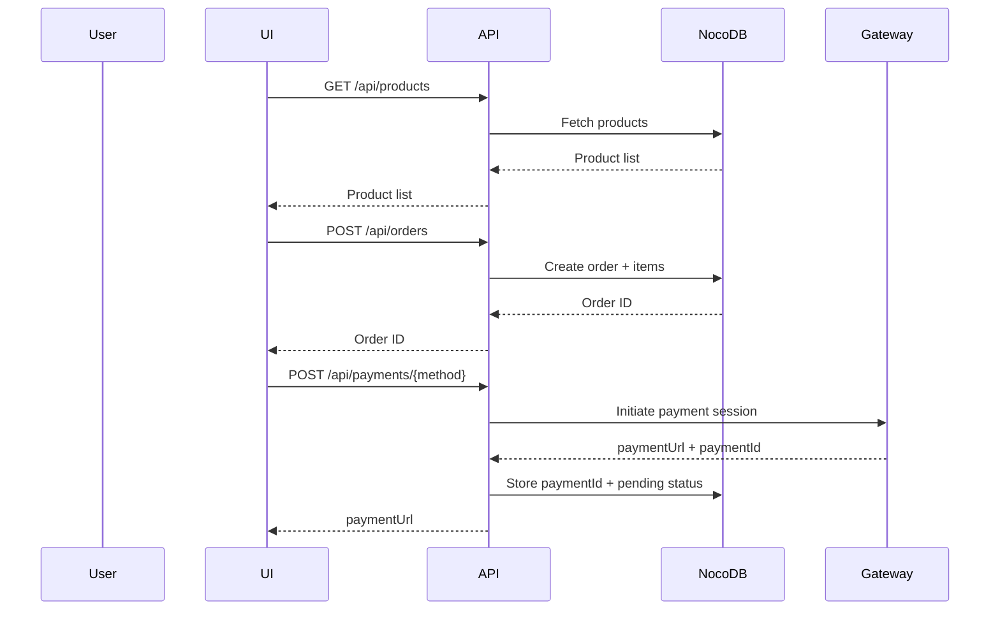
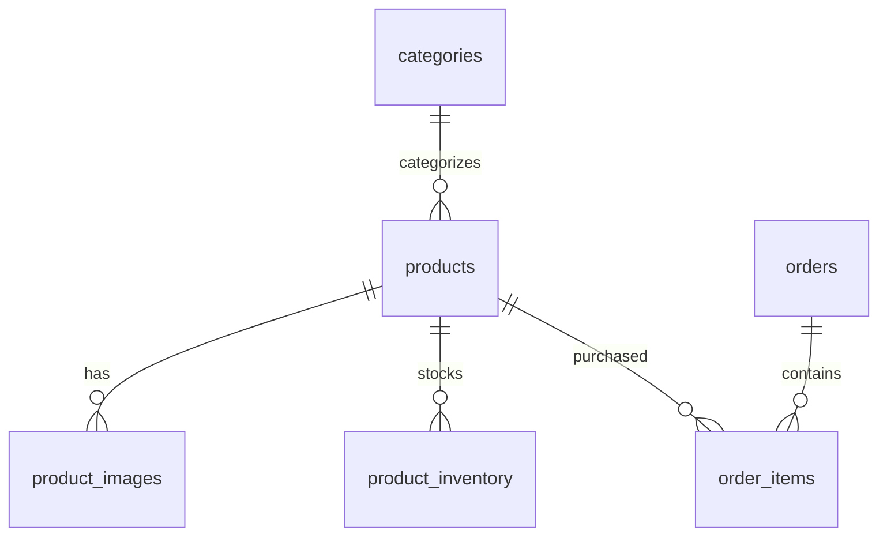

# Kids’ Clothing E‑Store (Bangladesh) — Development Plan

Source PRD: `Kids_Store_PRD_Junior_Dev.md`

## 1) Project Analysis

### 1.1 Functional Requirements (from PRD)

| Req ID | Functional Requirement | PRD Reference |
|---|---|---|
| FR-001 | Browse products (home + listing) | PRD “Folder Structure”, “Phase 1 Deliverable” |
| FR-002 | Product detail view | PRD “ProductDetail.tsx” |
| FR-003 | Variant selection (size + color) and quantity | PRD “ProductDetail.tsx” |
| FR-004 | Add to cart | PRD “ProductCard.tsx”, “CartStore (Zustand)” |
| FR-005 | Cart management (update qty, remove, total) | PRD “CartItem.tsx”, “CartStore (Zustand)” |
| FR-006 | Checkout delivery form with BD phone validation | PRD “DeliveryForm.tsx” |
| FR-007 | Payment method selection (bKash/Nagad) | PRD “PaymentSelector.tsx” |
| FR-008 | Create orders + items in database | PRD “orders”, “order_items” tables |
| FR-009 | Payment initiation via bKash + Nagad | PRD “/api/payments”, “lib/bkash.ts”, “lib/nagad.ts” |
| FR-010 | Payment status updates via webhooks | PRD “/api/webhooks/bkash.ts”, “/api/webhooks/nagad.ts” |
| FR-011 | Order tracking page | PRD `/order/[id]/page.tsx` |
| FR-012 | Transactional emails via Loops | PRD “Loops API”, “Phase 4 Notifications” |
| FR-013 | WhatsApp notifications | PRD “WhatsApp Business API”, “Phase 4 Notifications” |
| FR-014 | Catalog storage in NocoDB | PRD “NocoDB Tables” |
| FR-015 | Inventory per product+size+color | PRD “product_inventory” |
| FR-016 | Mobile responsiveness and Lighthouse ≥90 | PRD “Success Metrics” |
| FR-017 | Minimum 80% coverage | PRD `vitest.config.ts` |
| FR-018 | Admin dashboard (bonus) | PRD “Phase 5” |
| FR-019 | Error handling | PRD “Common pitfalls” |

### 1.2 Technical Constraints and Dependencies

Derived from PRD sections “Architecture Overview”, “Database Schema & APIs”, and external service lists:

- Next.js App Router + route handlers (`/app/api/*`)
- Tailwind CSS + shadcn/ui
- Zustand for cart state
- React Hook Form + Zod for forms and validation
- Vitest + Testing Library with coverage gates ≥80%
- NocoDB REST API (self-hosted)
- Loops transactional email
- bKash + Nagad payment gateways + webhooks
- WhatsApp Business API notifications
- Cloudinary (optional) for image CDN

### 1.3 Risks and Mitigation

| Risk | Impact | Likelihood | Mitigation |
|---|---|---:|---|
| Payment integration complexity | High | Medium | Integrate early in staging; isolate gateway modules; sandbox-first |
| Webhook duplicates/out-of-order | High | High | Idempotent processing; dedupe by payment reference; safe state transitions |
| NocoDB schema drift/mismatch | Medium | Medium | Freeze schema early; validate payloads; centralize mapping |
| WhatsApp approval delays | Medium | Medium | Feature-flag WhatsApp; ship email first |
| Secrets/PII leakage | High | Medium | Server-only secrets; scrub logs; security review checklist |
| Performance regressions | Medium | Medium | Next/Image; pagination; Lighthouse checks each milestone |

## 2) Development Phases

### Phase 1: Core infrastructure (DB schema, APIs, auth)

- Create NocoDB schema per PRD tables and relationships.
- Implement server-only NocoDB client wrapper.
- Create baseline APIs: products, orders, order tracking.
- Add authentication for any admin-only surfaces.

### Phase 2: Feature implementation (prioritized)

1) Product listing + categories
2) Product detail (variants)
3) Cart flows
4) Checkout delivery form + validation
5) Order creation + confirmation + tracking
6) Payment selection UI
7) bKash integration + webhooks
8) Nagad integration + webhooks
9) Loops emails
10) WhatsApp notifications
11) Admin dashboard (bonus)

### Phase 3: Integration testing and bug fixing

- End-to-end flow validation (browse → cart → checkout → pay → confirm).
- Negative testing: validation failures, payment failures, out-of-stock, webhook duplication.

### Phase 4: Performance optimization and security hardening

- Lighthouse optimization and real-device checks.
- Webhook verification, rate limiting, dependency audit, hardening of error handling.

## 3) Implementation Details

### 3.1 Stack Selection (Justification)

Stack aligns to PRD to reduce integration risk:
- Next.js + TypeScript for full-stack delivery with route handlers.
- shadcn/ui + Tailwind for accessible, consistent UI primitives.
- Zustand for minimal cart state.
- React Hook Form + Zod for type-safe validation.
- Vitest + Testing Library for TDD and coverage enforcement.
- NocoDB for schema-driven REST storage without SQL.
- Loops for transactional email.
- bKash/Nagad for Bangladesh payments.
- WhatsApp Business API for notifications.

### 3.2 Component Architecture Diagram

```mermaid
graph TD
  subgraph UI[Next.js UI]
    Listing[Products Listing]
    Detail[Product Detail]
    Cart[Cart]
    Checkout[Checkout]
    Track[Order Tracking]
    ProductCard[ProductCard]
    ProductGrid[ProductGrid]
    DeliveryForm[DeliveryForm]
    PaymentSelector[PaymentSelector]
    OrderSummary[OrderSummary]
  end

  subgraph State[Client State]
    CartStore[Zustand Cart Store]
  end

  subgraph API[Next.js API]
    ProductsAPI[/api/products]
    OrdersAPI[/api/orders]
    PaymentsAPI[/api/payments/*]
    WebhooksAPI[/api/webhooks/*]
  end

  subgraph External[External Services]
    NocoDB[NocoDB]
    Loops[Loops]
    Bkash[bKash]
    Nagad[Nagad]
    WhatsApp[WhatsApp]
  end

  Listing --> ProductsAPI --> NocoDB
  Detail --> ProductsAPI
  Detail --> CartStore
  Cart --> CartStore
  Checkout --> CartStore
  Checkout --> OrdersAPI --> NocoDB
  Checkout --> PaymentsAPI --> Bkash
  Checkout --> PaymentsAPI --> Nagad
  WebhooksAPI --> NocoDB
  WebhooksAPI --> Loops
  WebhooksAPI --> WhatsApp
```

### 3.3 API Specifications and Data Flows

See [API](API.md). Data flows are shown below.



### 3.4 Database Schema Design (Relationships)



Implement table fields as defined in the PRD “NocoDB Tables” section.

## 4) Testing Strategy

- Coverage requirement: ≥80% lines/functions/branches/statements (PRD `vitest.config.ts`).
- Unit tests: components, stores, validation schemas, libs.
- Integration tests: API route handlers and webhook idempotency.
- UAT: mobile flows, checkout, payments, notifications, tracking.
- Performance: Lighthouse ≥90, LCP ≤2.5s, CLS ≤0.1.

## 5) Timeline Estimation (weekly milestones)

Includes a 20% contingency buffer.

| Week | Milestone | Deliverables |
|---:|---|---|
| 1 | Infra + auth | DB schema, API baseline, admin protection, tests/coverage gates |
| 2 | Storefront | Listing/detail/cart, responsive, Lighthouse baseline |
| 3 | Checkout + orders | Delivery form, order persistence, confirmation/tracking, Loops email |
| 4 | Payments | bKash + Nagad sandbox end-to-end, webhook idempotency |
| 5 | Hardening | Integration tests, bug bash, security hardening, WhatsApp if ready |
| 6 | Buffer (20%) | Spillover, polish, UAT fixes, performance tuning |

Critical path: schema → orders → payment init → webhooks → end-to-end validation.

## 6) Quality Standards

- Code review checklist is defined in [ENGINEERING_RULES](ENGINEERING_RULES.md).
- Accessibility target: WCAG 2.1 AA (shadcn/ui preferred).
- Performance targets: Lighthouse ≥90; API p95 products ≤300ms, orders ≤500ms.

## 7) Deployment Plan

- Staging: separate environment with sandbox credentials and NocoDB staging.
- CI/CD: PR checks for typecheck/lint/tests/coverage/build; staging deploy on main; manual promote to production.
- Rollback: deployment revert; additive DB changes only; keep backups.
- Monitoring: track webhook failures, payment failure spikes, and 5xx rates.

